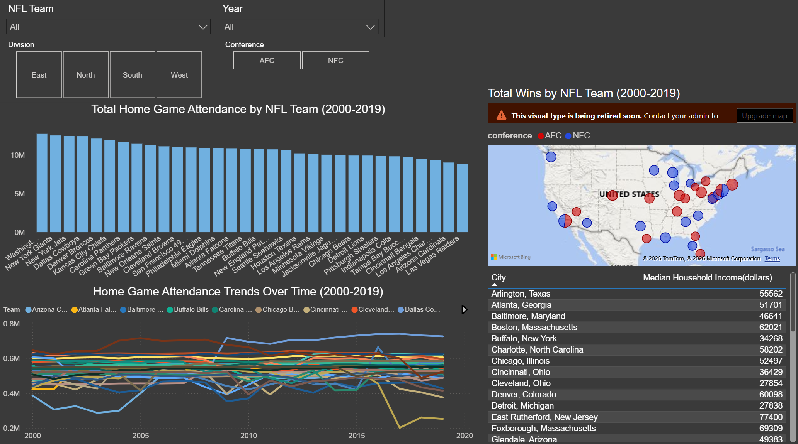

# **NFL Performance Analytics Dashboard**

An exploratory data analysis and interactive Power BI dashboard examining relationships between NFL team performance, home city demographics, and geographic patterns across the 2000-2019 seasons. 

---

## **Background**

Around the same time I began my master's program, I also found myself gravitating towards American Football, specifically following the team I was born into, the New York Jets. As I bolstered my experience working with data, I began focusing more on the numbers behind the games, realizing I was already subconsciously forming research questions out of my own curiosity. Beyond the games themselves, I found it equally interesting that players are not the only ones putting up numbers, as host cities have historically seen economic ripple effects from franchises, including infrastructure investment and boosts in local business activity. This project explores the broader relationship between NFL teams, their home cities, and the patterns that emerge across franchises and regions over time. 

---

## **Research Questions**

- Is NFL competitive success geographically concentrated?
- Do NFL teams exhibit geographic differences in home-field advantage?
- Are Super Bowl wins or play styles geographically clustered across NFL regions?
- Do city characteristics such as median household income influence scoring and team performance?

---

## **Datasets**

**NFL Teams Data**
*(Kayla96, 2023)*

Covering the entire NFL, this dataset contains 11 variables: team name, stadium name, stadium location, latitude, longitude, mascot, live mascot, conference, division, Superbowl wins, and year established for all 32 franchises. It will additionally function as a key table, linking team name and location across all other tables, supporting city, state, and national level visualizations. 

**NFL Stadium Attendance Dataset**
*(Sujay Kapadnis, 2023)*

Compiling NFL game attendance from 2000 to 2019, this dataset includes three CSV files. *attendance.csv* contains 8 variables for 10,846 cases, tracking weekly and annual attendance by team. *games.csv* contains 19 variables for 5,243 cases, covering game-level outcomes including points, yardage, and turnovers for winning and losing teams. Lastly, *standings.csv* contains 15 variables for 638 cases, covering season-level performance metrics including wins, losses, point differential, margin of victory, strength of schedule, and offensive and defensive ratings. It should be noted that in cases like the Jets/Giants and Rams/Chargers, New York and Los Angeles are listed as the respective teams' cities rather than their true stadium locations, requiring transformation prior to linking tables in Power BI.

**U.S. Census Bureau -- American Community Survey (ACS) 5-Year Estimates (2017)**
*(U.S. Census Bureau, n.d.)*

One table was extracted for use in this project. **S1901** contains household income distribution variables including median household income across varying income brackets for each city. The table contains data for 39 cases covering all 28 stadium city locations along with 11 additional cities for teams that changed stadium locations, play outside of their title cities, or better represent surrounding municipalities: St. Louis and Los Angeles for the Rams, San Diego and Los Angeles for the Chargers, San Francisco for the 49ers, Boston for the Patriots, Buffalo for the Bills, New York for the Jets and Giants, Washington D.C. for the Commanders, Miami for the Dolphins, and Las Vegas and Oakland for the Raiders.

---

## **Data Preparation**

The four source tables were cleaned and restructured prior to analysis. Team city locations for the Jets, Giants, Rams, Chargers, and Raiders were corrected from title city names to true stadium locations before linking tables in Power BI. Census S1901 income data was extracted at Place-level geography and cleaned from its original formatting for use in Excel. For franchises with multiple associated cities, median household income values were averaged across relevant locations. All derived analysis sheets are included in the Excel workbook alongside the four source tables.

---

## **Key Findings**

**Geographic Concentration of Success**

A choropleth map of total team wins by state from 2000 to 2019 reveals that California, Florida, Texas, and Pennsylvania account for a disproportionate share of cumulative wins, driven by both the number of franchises housed in those states along with their sustained success over the two-decade period. Win success appears geographically clustered rather than randomly distributed, concentrated particularly along both coasts and in the South.

**Divisional Performance Patterns**

The New England Patriots stand out across the period with 237 total wins, more than double the Cleveland Browns at 99 wins (the most and least successful franchises respectively). At the divisional level, the AFC North distinguished itself as the strongest defensive division with an average rating of 1.18, driven largely by the Baltimore Ravens and Pittsburgh Steelers, while the AFC West led offensively at 0.815. The NFC West and AFC South are the only divisions that were negative in both offensive and defensive average ratings, suggesting a sustained period of below-average performance across both sides of the ball. 

**City Income vs. Team Performance**

A scatter plot of median household income against total wins for all 32 franchises reveals virtually no relationship, with an R-squared value of 0.0254 indicating that host city income explains approximately 2.5% of the variation in team wins. Notable counterexamples include the San Francisco 49ers with 148 wins despite having the highest median income, and the Pittsburgh Steelers accumulating 205 wins as one the lower median income cities within the dataset. These findings suggest that competition-balancing mechanisms such as salary caps and the draft system effectively level the playing field regardless of varying host city economic profiles.

---

## **Dashboard Overview**

The interactive Power BI dashboard allows for exploration of attendance and geographic performance data across all 32 franchises. Four interactive slicers filter all visuals simultaneously by NFL team, year, division, and conference. Cross-filtering functionality allows users to click any stadium city in the Census income table to highlight its corresponding team across all other visuals. 

Dashboard visuals include:
- Bubble map of total wins by stadium location
- Bar chart of total home game attendance by franchise
- Line chart tracking attendance trends from 2000 to 2019
- Census income table with cross-filter linking to all other visuals

*Note: Screenshots were captured within an institutional Power BI environmenht. The map visual displays an upgrade prompt due to institutional licensing restrictions; the underlying data and configuration are intact within the repository's .pbix file. Additonally, the Census income table extends beyond the visible screenshot area but can be accessed fully by utilizing the included .pbix file*

--- 

## **Tools Used**

- **Power BI** -- Interactive dashboard development, data modeling, DAX calculations
- **Microsoft Excel** -- data preparation, AVERAGEIFS calculations, static visualization design
- **U.S. Census Bureau** -- ACS 5-year estimates extracted at Place-level geography

---

## **Limitations and Future Directions**

The Census income data represents a single snapshot rather than a longitudinal series, making it difficult to observe whether city-level economic characteristics change following stadium relocation or new franchise announcements, a question raised during this project but unable to be fully answered within the current scope. Future analysis could incorporate multiple years of ACS data, population growth figures, stadium capacity, and game-level scoring data to further investigate home-field advantage and the economic relationship between franchises and their host cities. 

---

## **References**

Benz, L., Bliss, T., & Lopez, M. (2024). A comprehensive survey of the home advantage in American football. Journal of Quantitative Analysis in Sports, 20(4), 277–291. https://doi.org/10.1515/jqas-2024-0016

Exploring the Economic Impact of the NFL on Host Cities. (2024, April 14). Athleisure MagTM | Athleisure Culture. http://www.athleisuremag.com/the-latest/2024/4/14/exploring-the-economic-impact-of-the-nfl-on-host-cities

NFL Stadium Attendance Dataset. (2023, October 16). https://www.kaggle.com/datasets/sujaykapadnis/nfl-stadium-attendance-dataset

NFL Teams Data. (2023, November 14). https://www.kaggle.com/datasets/kayla96/nfl-teams-data

US Census Bureau. (n.d.). Census Bureau Data and Maps. Census.Gov. Retrieved April 3, 2026, from https://www.census.gov/data.html

